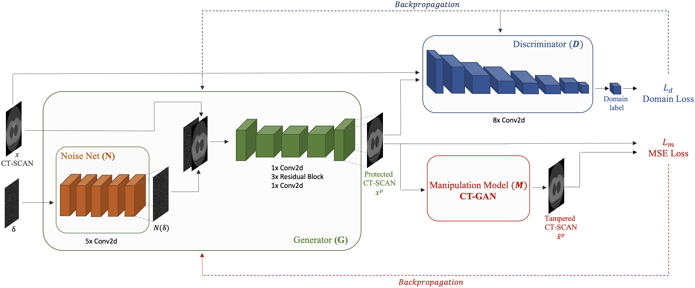
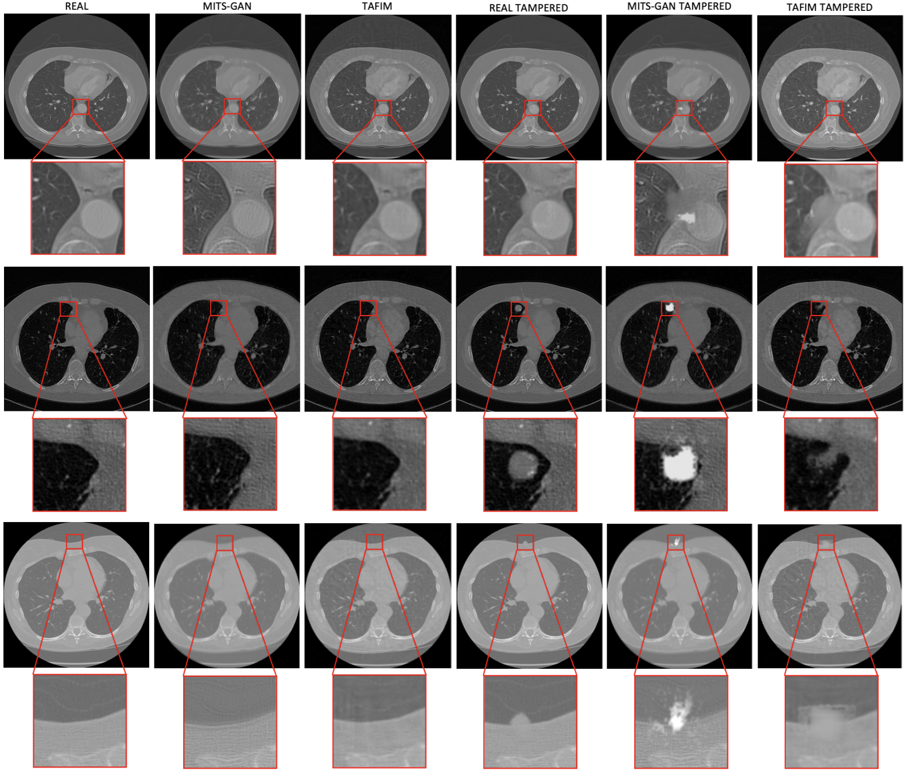

# MITS-GAN
This is the implementation of our submitted Artificial Intelligence in Medicine 2024 work 'MITS-GAN: Safeguarding Medical Imaging from Tampering with Generative Adversarial Networks'. This study introduces MITS-GAN, a novel approach to prevent tampering in medical images, with a specific focus on CT scans. The approach disrupts the output of the attacker's CT-GAN architecture by introducing imperceptible but yet precise perturbations. The original paper can be found [here](https://arxiv.org/pdf/2401.09624.pdf). <br>
Please leave a star ⭐ and cite the following [paper](https://arxiv.org/pdf/2401.09624.pdf) if you use this repository for your project.
```
@misc{pasqualino2024mitsgan,
      title={MITS-GAN: Safeguarding Medical Imaging from Tampering with Generative Adversarial Networks}, 
      author={Giovanni Pasqualino and Luca Guarnera and Alessandro Ortis and Sebastiano Battiato},
      year={2024},
      eprint={2401.09624},
      archivePrefix={arXiv},
      primaryClass={eess.IV}
}
```
### Coming soon
Models and code will be publicly available after the paper publication.

## MITS-GAN Architecture
<center></center>


## Results
Qualitative results on the reconstruction task compared with images as manipulation targets.
<center></center>

Metric results evaluated between the following pairs on the: real-MITS-GAN, real-TAFIM, real-MITS-GAN tampered and real-TAFIM tampered. Lower values are better for RMSE and LPIPS, higher for PSNR.

| Metric        | Real (MITS-GAN) | Real (TAFIM) | Tampered (MITS-GAN T.) | Tampered (TAFIM T.) |
|---------------|------------------|--------------|------------------------|---------------------|
| RMSE          | 169.481          | 194.943      | 198.253                | 233.780             |
| PSNR          | 27.949           | 21.702       | 21.237                 | 21.469              |
| LPIPS         | 0.170            | 0.383        | 0.226                  | 0.391               |
